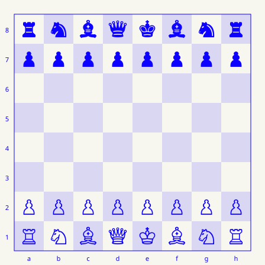

i love to make things that humans enjoy. i lead [clear](https://clearsol.network/).

<!-- CHESS:START -->

## your move

**black to move.** game 1. last move: e4.

Choose a move below, then submit the issue. The board updates after GitHub runs it.

play a move

- **knight b8**: [Nc6](https://github.com/eternitybro/eternitybro/issues/new?title=chess%3Afc91b293d002d220707cc34b519b0639624f5e4f2b52309fe3d9e0009a97fd8e%3Ab8c6&body=Play+Nc6+in+the+shared+game.%0A%0ASubmit+this+issue+to+play.+Closed+as+Completed+means+your+move+was+played.+Closed+as+Not+planned+means+it+was+not+played%2C+usually+because+the+board+changed.%0A%0ARefresh+%5Bthe+profile%5D%28https%3A%2F%2Fgithub.com%2Feternitybro%29+to+choose+a+current+move.) · [Na6](https://github.com/eternitybro/eternitybro/issues/new?title=chess%3Afc91b293d002d220707cc34b519b0639624f5e4f2b52309fe3d9e0009a97fd8e%3Ab8a6&body=Play+Na6+in+the+shared+game.%0A%0ASubmit+this+issue+to+play.+Closed+as+Completed+means+your+move+was+played.+Closed+as+Not+planned+means+it+was+not+played%2C+usually+because+the+board+changed.%0A%0ARefresh+%5Bthe+profile%5D%28https%3A%2F%2Fgithub.com%2Feternitybro%29+to+choose+a+current+move.)
- **knight g8**: [Nh6](https://github.com/eternitybro/eternitybro/issues/new?title=chess%3Afc91b293d002d220707cc34b519b0639624f5e4f2b52309fe3d9e0009a97fd8e%3Ag8h6&body=Play+Nh6+in+the+shared+game.%0A%0ASubmit+this+issue+to+play.+Closed+as+Completed+means+your+move+was+played.+Closed+as+Not+planned+means+it+was+not+played%2C+usually+because+the+board+changed.%0A%0ARefresh+%5Bthe+profile%5D%28https%3A%2F%2Fgithub.com%2Feternitybro%29+to+choose+a+current+move.) · [Nf6](https://github.com/eternitybro/eternitybro/issues/new?title=chess%3Afc91b293d002d220707cc34b519b0639624f5e4f2b52309fe3d9e0009a97fd8e%3Ag8f6&body=Play+Nf6+in+the+shared+game.%0A%0ASubmit+this+issue+to+play.+Closed+as+Completed+means+your+move+was+played.+Closed+as+Not+planned+means+it+was+not+played%2C+usually+because+the+board+changed.%0A%0ARefresh+%5Bthe+profile%5D%28https%3A%2F%2Fgithub.com%2Feternitybro%29+to+choose+a+current+move.)
- **pawn a7**: [a6](https://github.com/eternitybro/eternitybro/issues/new?title=chess%3Afc91b293d002d220707cc34b519b0639624f5e4f2b52309fe3d9e0009a97fd8e%3Aa7a6&body=Play+a6+in+the+shared+game.%0A%0ASubmit+this+issue+to+play.+Closed+as+Completed+means+your+move+was+played.+Closed+as+Not+planned+means+it+was+not+played%2C+usually+because+the+board+changed.%0A%0ARefresh+%5Bthe+profile%5D%28https%3A%2F%2Fgithub.com%2Feternitybro%29+to+choose+a+current+move.) · [a5](https://github.com/eternitybro/eternitybro/issues/new?title=chess%3Afc91b293d002d220707cc34b519b0639624f5e4f2b52309fe3d9e0009a97fd8e%3Aa7a5&body=Play+a5+in+the+shared+game.%0A%0ASubmit+this+issue+to+play.+Closed+as+Completed+means+your+move+was+played.+Closed+as+Not+planned+means+it+was+not+played%2C+usually+because+the+board+changed.%0A%0ARefresh+%5Bthe+profile%5D%28https%3A%2F%2Fgithub.com%2Feternitybro%29+to+choose+a+current+move.)
- **pawn b7**: [b6](https://github.com/eternitybro/eternitybro/issues/new?title=chess%3Afc91b293d002d220707cc34b519b0639624f5e4f2b52309fe3d9e0009a97fd8e%3Ab7b6&body=Play+b6+in+the+shared+game.%0A%0ASubmit+this+issue+to+play.+Closed+as+Completed+means+your+move+was+played.+Closed+as+Not+planned+means+it+was+not+played%2C+usually+because+the+board+changed.%0A%0ARefresh+%5Bthe+profile%5D%28https%3A%2F%2Fgithub.com%2Feternitybro%29+to+choose+a+current+move.) · [b5](https://github.com/eternitybro/eternitybro/issues/new?title=chess%3Afc91b293d002d220707cc34b519b0639624f5e4f2b52309fe3d9e0009a97fd8e%3Ab7b5&body=Play+b5+in+the+shared+game.%0A%0ASubmit+this+issue+to+play.+Closed+as+Completed+means+your+move+was+played.+Closed+as+Not+planned+means+it+was+not+played%2C+usually+because+the+board+changed.%0A%0ARefresh+%5Bthe+profile%5D%28https%3A%2F%2Fgithub.com%2Feternitybro%29+to+choose+a+current+move.)
- **pawn c7**: [c6](https://github.com/eternitybro/eternitybro/issues/new?title=chess%3Afc91b293d002d220707cc34b519b0639624f5e4f2b52309fe3d9e0009a97fd8e%3Ac7c6&body=Play+c6+in+the+shared+game.%0A%0ASubmit+this+issue+to+play.+Closed+as+Completed+means+your+move+was+played.+Closed+as+Not+planned+means+it+was+not+played%2C+usually+because+the+board+changed.%0A%0ARefresh+%5Bthe+profile%5D%28https%3A%2F%2Fgithub.com%2Feternitybro%29+to+choose+a+current+move.) · [c5](https://github.com/eternitybro/eternitybro/issues/new?title=chess%3Afc91b293d002d220707cc34b519b0639624f5e4f2b52309fe3d9e0009a97fd8e%3Ac7c5&body=Play+c5+in+the+shared+game.%0A%0ASubmit+this+issue+to+play.+Closed+as+Completed+means+your+move+was+played.+Closed+as+Not+planned+means+it+was+not+played%2C+usually+because+the+board+changed.%0A%0ARefresh+%5Bthe+profile%5D%28https%3A%2F%2Fgithub.com%2Feternitybro%29+to+choose+a+current+move.)
- **pawn d7**: [d6](https://github.com/eternitybro/eternitybro/issues/new?title=chess%3Afc91b293d002d220707cc34b519b0639624f5e4f2b52309fe3d9e0009a97fd8e%3Ad7d6&body=Play+d6+in+the+shared+game.%0A%0ASubmit+this+issue+to+play.+Closed+as+Completed+means+your+move+was+played.+Closed+as+Not+planned+means+it+was+not+played%2C+usually+because+the+board+changed.%0A%0ARefresh+%5Bthe+profile%5D%28https%3A%2F%2Fgithub.com%2Feternitybro%29+to+choose+a+current+move.) · [d5](https://github.com/eternitybro/eternitybro/issues/new?title=chess%3Afc91b293d002d220707cc34b519b0639624f5e4f2b52309fe3d9e0009a97fd8e%3Ad7d5&body=Play+d5+in+the+shared+game.%0A%0ASubmit+this+issue+to+play.+Closed+as+Completed+means+your+move+was+played.+Closed+as+Not+planned+means+it+was+not+played%2C+usually+because+the+board+changed.%0A%0ARefresh+%5Bthe+profile%5D%28https%3A%2F%2Fgithub.com%2Feternitybro%29+to+choose+a+current+move.)
- **pawn e7**: [e6](https://github.com/eternitybro/eternitybro/issues/new?title=chess%3Afc91b293d002d220707cc34b519b0639624f5e4f2b52309fe3d9e0009a97fd8e%3Ae7e6&body=Play+e6+in+the+shared+game.%0A%0ASubmit+this+issue+to+play.+Closed+as+Completed+means+your+move+was+played.+Closed+as+Not+planned+means+it+was+not+played%2C+usually+because+the+board+changed.%0A%0ARefresh+%5Bthe+profile%5D%28https%3A%2F%2Fgithub.com%2Feternitybro%29+to+choose+a+current+move.) · [e5](https://github.com/eternitybro/eternitybro/issues/new?title=chess%3Afc91b293d002d220707cc34b519b0639624f5e4f2b52309fe3d9e0009a97fd8e%3Ae7e5&body=Play+e5+in+the+shared+game.%0A%0ASubmit+this+issue+to+play.+Closed+as+Completed+means+your+move+was+played.+Closed+as+Not+planned+means+it+was+not+played%2C+usually+because+the+board+changed.%0A%0ARefresh+%5Bthe+profile%5D%28https%3A%2F%2Fgithub.com%2Feternitybro%29+to+choose+a+current+move.)
- **pawn f7**: [f6](https://github.com/eternitybro/eternitybro/issues/new?title=chess%3Afc91b293d002d220707cc34b519b0639624f5e4f2b52309fe3d9e0009a97fd8e%3Af7f6&body=Play+f6+in+the+shared+game.%0A%0ASubmit+this+issue+to+play.+Closed+as+Completed+means+your+move+was+played.+Closed+as+Not+planned+means+it+was+not+played%2C+usually+because+the+board+changed.%0A%0ARefresh+%5Bthe+profile%5D%28https%3A%2F%2Fgithub.com%2Feternitybro%29+to+choose+a+current+move.) · [f5](https://github.com/eternitybro/eternitybro/issues/new?title=chess%3Afc91b293d002d220707cc34b519b0639624f5e4f2b52309fe3d9e0009a97fd8e%3Af7f5&body=Play+f5+in+the+shared+game.%0A%0ASubmit+this+issue+to+play.+Closed+as+Completed+means+your+move+was+played.+Closed+as+Not+planned+means+it+was+not+played%2C+usually+because+the+board+changed.%0A%0ARefresh+%5Bthe+profile%5D%28https%3A%2F%2Fgithub.com%2Feternitybro%29+to+choose+a+current+move.)
- **pawn g7**: [g6](https://github.com/eternitybro/eternitybro/issues/new?title=chess%3Afc91b293d002d220707cc34b519b0639624f5e4f2b52309fe3d9e0009a97fd8e%3Ag7g6&body=Play+g6+in+the+shared+game.%0A%0ASubmit+this+issue+to+play.+Closed+as+Completed+means+your+move+was+played.+Closed+as+Not+planned+means+it+was+not+played%2C+usually+because+the+board+changed.%0A%0ARefresh+%5Bthe+profile%5D%28https%3A%2F%2Fgithub.com%2Feternitybro%29+to+choose+a+current+move.) · [g5](https://github.com/eternitybro/eternitybro/issues/new?title=chess%3Afc91b293d002d220707cc34b519b0639624f5e4f2b52309fe3d9e0009a97fd8e%3Ag7g5&body=Play+g5+in+the+shared+game.%0A%0ASubmit+this+issue+to+play.+Closed+as+Completed+means+your+move+was+played.+Closed+as+Not+planned+means+it+was+not+played%2C+usually+because+the+board+changed.%0A%0ARefresh+%5Bthe+profile%5D%28https%3A%2F%2Fgithub.com%2Feternitybro%29+to+choose+a+current+move.)
- **pawn h7**: [h6](https://github.com/eternitybro/eternitybro/issues/new?title=chess%3Afc91b293d002d220707cc34b519b0639624f5e4f2b52309fe3d9e0009a97fd8e%3Ah7h6&body=Play+h6+in+the+shared+game.%0A%0ASubmit+this+issue+to+play.+Closed+as+Completed+means+your+move+was+played.+Closed+as+Not+planned+means+it+was+not+played%2C+usually+because+the+board+changed.%0A%0ARefresh+%5Bthe+profile%5D%28https%3A%2F%2Fgithub.com%2Feternitybro%29+to+choose+a+current+move.) · [h5](https://github.com/eternitybro/eternitybro/issues/new?title=chess%3Afc91b293d002d220707cc34b519b0639624f5e4f2b52309fe3d9e0009a97fd8e%3Ah7h5&body=Play+h5+in+the+shared+game.%0A%0ASubmit+this+issue+to+play.+Closed+as+Completed+means+your+move+was+played.+Closed+as+Not+planned+means+it+was+not+played%2C+usually+because+the+board+changed.%0A%0ARefresh+%5Bthe+profile%5D%28https%3A%2F%2Fgithub.com%2Feternitybro%29+to+choose+a+current+move.)

<!-- CHESS:END -->

inspired by [Tim Burgan's community chess](https://github.com/timburgan). [come say hi](https://www.robgungor.com/).
