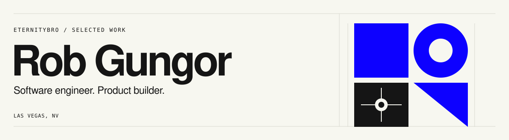

<picture>
  <source media="(prefers-color-scheme: dark)" srcset="assets/header-dark.svg">
  <source media="(prefers-color-scheme: light)" srcset="assets/header-light.svg">
  
</picture>

I build products, interfaces, and developer tools. My work spans React and TypeScript applications, on-chain systems, and practical AI workflows.

Previously at **Goldbelly** and **Brainbase**. Based in **Las Vegas**.

[Website](https://www.robgungor.com/) · [LinkedIn](https://www.linkedin.com/in/robgungor/) · [Projects at robebots](https://github.com/robebots)

## Selected work

### [Tempo research application](https://github.com/robebots/tempo-stablecoin-infrastructure-audit)
An interactive research application that brings together on-chain data collection, evidence checks, and financial models. I built the research tooling and interface to make the findings inspectable.

**Next.js · TypeScript · Python**  
[Explore the application](https://tempo-stablecoin-infrastructure-aud.vercel.app/) · [Inspect the indexing work](https://github.com/robebots/tempo-stablecoin-infrastructure-audit/commit/1a65691c119e135028d7984dd580c7d13f67a308)

### [kb](https://github.com/robebots/kb)
An agent workflow for turning source documents into a linked Markdown knowledge base with cited answers. I organized the workflow around portable files, source provenance, and a small set of commands.

**Shell · Markdown · AI workflows**  
[Read the source](https://github.com/robebots/kb) · [See the workflow refactor](https://github.com/robebots/kb/commit/b4649c41c074b9d7bdcd89d176e7b28d29b5f493)

### [Clear deposit UI](https://github.com/clear-labs/label-deposit-ui-nextjs)
A frontend template for connecting a wallet, entering a deposit, and following a transaction through confirmation. I built the Next.js interface and wallet integration.

**Next.js · React · TypeScript**  
[Read the source](https://github.com/clear-labs/label-deposit-ui-nextjs) · [See the implementation](https://github.com/clear-labs/label-deposit-ui-nextjs/commit/fd6774f9f48cc3ea45c51078328fe0efd79badc9)

## Selected contributions

- **Verifi:** Adapted and deployed governance software built on Snapshot's foundation. [Deployment work](https://github.com/verifi-labs/evm/commit/82d2b799c29255c509a08292445f7b32bd0ad410) · [Voting-power read correction](https://github.com/verifi-labs/verifi.js/commit/5a04c350129680d7cebf5fc20f3af27e54b105b9).
- **create-wagmi:** Documented a dependency issue and shared a working configuration workaround. [Discussion](https://github.com/wevm/create-wagmi/issues/80#issuecomment-1639618714).

## In the workshop

I build tools with AI agents under [robebots](https://github.com/robebots). [eternitybrot](https://github.com/eternitybrot) is the automation account. Project histories preserve collaborator and agent credit.

Outside software, I've made music, fragrances, and a coffee shop. [More about me](https://www.robgungor.com/).
